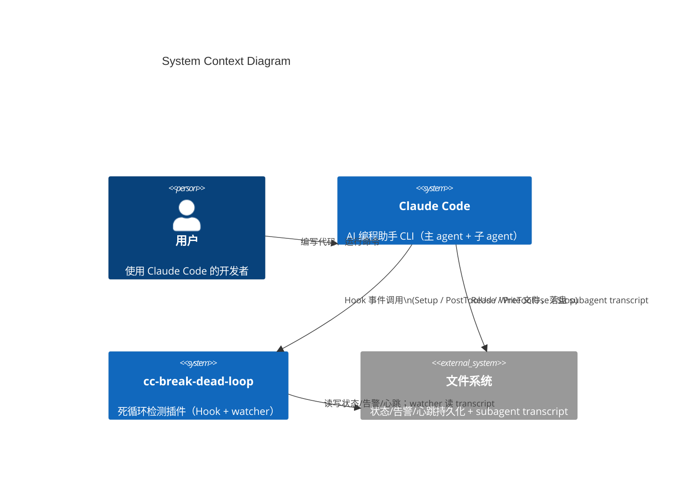
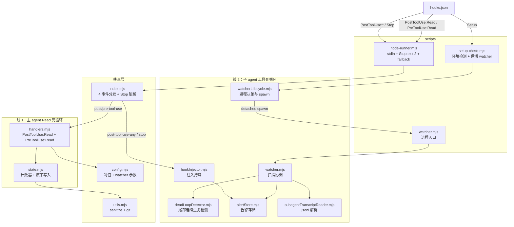

# 架构总览

## 系统上下文（C4 Level 1）

本插件作为 Claude Code 的观察者 + 干预者运行，不修改现有代码。watcher 作为独立常驻进程观察 subagent transcript。



## 容器架构（C4 Level 2）

```mermaid
C4Container
  title Container Diagram

  Person(user, "用户", "使用 Claude Code 的开发者")
  System_Boundary(cc, "Claude Code") {
    Container(hook_engine, "Hook 引擎", "内置", "Setup / PostToolUse / PreToolUse / Stop 生命周期")
    Container(subagents, "子 agent", "内置", "transcript 落盘到 ~/.claude/projects/")
  }
  System_Boundary(plugin, "cc-break-dead-loop") {
    Container(scripts, "plugin/scripts/", "Node.js", "setup-check + node-runner + watcher 入口")
    Container(src, "plugin/src/", "ES Module", "核心业务逻辑（11 模块）")
    Container(watcher_proc, "watcher 进程", "Node.js detached", "常驻扫描 subagent transcript")
    Container(cli, "src/cli/", "Node.js", "CLI 工具（install / uninstall / status）")
    ContainerDb(state, "数据文件", "JSON", "state.json / alerts.json / heartbeat / pid")
  }
  System_Ext(filesystem, "目标文件系统", "", "被 Read 的文件")

  Rel(user, cc, "交互")
  Rel(user, cli, "npx cc-break-dead-loop install")
  Rel(hook_engine, scripts, "spawn 子进程\nstdin 注入 JSON")
  Rel(scripts, src, "import 并调用 main()")
  Rel(scripts, watcher_proc, "setup-check detached spawn")
  Rel(watcher_proc, src, "import watcher/alertStore/detector")
  Rel(src, state, "readState / writeState / alert 读写")
  Rel(watcher_proc, filesystem, "读 agent-*.jsonl")
  Rel(cc, filesystem, "Read 工具调用")
```

## 组件架构（C4 Level 3）



## 架构模式

### 1. 双线检测（Dual-Track Detection）

| 线 | 目标 agent | 机制 | 阻断方式 |
|----|-----------|------|----------|
| 线 1 | 主 agent | 双 Hook（PostToolUse:Read 计数 + PreToolUse:Read 拦截）| `permissionDecision: 'deny'` |
| 线 2 | 子 agent | watcher 扫 transcript + Stop/PostToolUse:`*` 注入 | 引导主 agent 调 `TaskStopTool` |

两条线通过不同机制解决不同 agent 类型的死循环。线 1 依赖 deny（对主 agent 有效），线 2 绕过 deny 失效问题（子 agent 无视 deny，改为让主 agent 终止子 agent）。

### 2. watcher 常驻进程模式（线 2）

subagent transcript 是**事后落盘**的 jsonl，Hook 无法实时拿到完整调用序列。因此线 2 采用 detached 常驻进程：

- `setup-check.mjs` 在 Setup Hook 中 `ensureWatcherRunning`（detached spawn + unref）
- watcher 每 5s 全量扫描所有 `agent-*.jsonl`，检测尾部连续重复
- 心跳机制（`watcher-heartbeat.json`）判断存活，过期则下次 Setup restart
- PID 文件（`watcher.pid`）用于重启时 kill 旧进程

### 3. 全量重算 + 增量同步（线 2 告警）

每次扫描全量重算当前死循环集合，与上次集合对比：

- 消失的死循环 → `removeAlert`（子 agent 被 kill 后清理残留告警）
- 持续/新增 → `addAlert`（upsert 更新 `detectedAt`）

避免告警残留导致主 agent 被持续阻断。

### 4. 多层降级（Defense in Depth）

```
Layer 1: hooks.json command
    └── bash 展开 ${CLAUDE_PLUGIN_ROOT}

Layer 2: node-runner.mjs
    └── stdin 5s 超时 + 异常 → { continue: true } + exit(0)

Layer 3: plugin/src/index.mjs
    └── JSON 解析 try/catch + handler 调用 try/catch

Layer 4: plugin/src/handlers.mjs / hookInjector.mjs
    └── 参数缺失 / 无告警 → 静默放行

Layer 5: watcher 子系统
    └── 扫描异常跳过损坏文件
    └── 崩溃由心跳过期 + 下次 Setup restart 自愈

Layer 6: setup-check.mjs
    └── watcher 启动失败仅 console.error，exit(0) 永不阻断 Claude Code
```

### 5. 原子写入

`state.json`、`alerts.json` 均用 `writeFile(tmp) → rename(dest)`：

```javascript
const tmpPath = `${filePath}.tmp.${Date.now()}.${process.pid}`;
writeFileSync(tmpPath, JSON.stringify(data, null, 2));
renameSync(tmpPath, filePath);  // 原子操作
```

## 关键设计决策

| ID | 决策 | 理由 |
|----|------|------|
| D1 | `utils.mjs` 合并 sanitize + git | 两功能单一，总量小 |
| D2 | hooks.json 用 bash 展开 `${CLAUDE_PLUGIN_ROOT}` | 避免硬编码绝对路径 |
| D3 | node-runner.mjs graceful fallback | 任何异常静默降级，不阻断 Read |
| D5 | Handler 统一 try/catch 边界 | 插件 bug 永不阻断正常 Read |
| D6 | 三层 toolResponse 检测（线 1）| 兼容 Claude Code 版本变更 |
| D7 | `===` 直接比较参数，不规范化 `undefined→0`（线 1）| 不同调用意图不应等同 |
| W1 | watcher 用 detached 常驻进程而非 Hook 内联（线 2）| subagent transcript 事后落盘，Hook 无法实时拿到；常驻进程可定时全量扫描 |
| W2 | 线 2 不用 deny 而用 Stop blockingError（线 2）| subagent 无视 `permissionDecision: deny`（#25000/#34692），改为在主 agent 的 Stop hook 返回 `blockingError`（`exit 2`），引导主 agent 调 `TaskStopTool` 终止子 agent |
| W3 | 告警单文件 + sessionId 过滤隔离（线 2）| 避免多 session 多文件管理复杂度 |
| W4 | watcher 全量重算 + 增量同步（线 2）| 解决子 agent 被 kill 后告警残留 |
| W5 | 心跳 + PID 双文件管理生命周期（线 2）| 心跳判存活（stale → restart），PID 用于 kill 旧进程 |

## 模块分解

### plugin/src/index.mjs — Hook 入口
- **职责**：stdin 解析、4 事件分发（post-tool-use / pre-tool-use-read / post-tool-use-any / stop）、Stop 阻断（`shouldBlock` → `exit 2`）、统一错误边界
- **关键函数**：`main(event, stdinData)`、`postToolUseAnyAlert`、`stopAlert`

### plugin/src/handlers.mjs — 线 1 双 Handler
- **职责**：主 agent Read 死循环检测与拦截
- **关键函数**：`postToolUse`（计数）、`preToolUseRead`（警告/阻断）、`isWastedCall`（多模式检测）

### plugin/src/state.mjs — 线 1 状态管理
- **职责**：主 agent Read 计数持久化、原子写入、参数比较
- **关键函数**：`getStateDir`、`readState`、`writeState`、`incrementCounter`、`isSameReadParams`

### plugin/src/watcher.mjs — 线 2 扫描协调
- **职责**：递归找 `agent-*.jsonl` → 读 tool_use → 检测死循环 → 同步告警 → 写心跳
- **关键函数**：`createWatcher`、`scanOnce`、`start`、`stop`、`findAllAgentJsonls`、`parseAgentFromPath`

### plugin/src/watcherLifecycle.mjs — 线 2 进程管理
- **职责**：决策 watcher 是否需要（重）启动，执行 detached spawn / kill 旧进程
- **关键函数**：`decideAction`（纯决策：none/start/restart）、`ensureWatcherRunning`（执行层）、`killOldProcess`

### plugin/src/deadLoopDetector.mjs — 线 2 检测算法
- **职责**：给定 tool_use 序列，判定尾部是否构成死循环
- **关键函数**：`detectDeadLoop`（尾部连续重复计数）、`stableStringify`（对象键排序序列化指纹）
- Pure function，无副作用

### plugin/src/alertStore.mjs — 线 2 告警存储
- **职责**：子 agent 死循环告警共享状态（watcher 写 / hooks 读）
- **关键函数**：`addAlert`（upsert by taskId）、`removeAlert`、`getAlertsForSession`、原子写入

### plugin/src/hookInjector.mjs — 线 2 注入逻辑
- **职责**：读告警，生成 hook 响应（`additionalContext` / `blockingError`），纯语义不关心协议细节
- **关键函数**：`buildInjection`、`postToolUseMessage`、`stopMessage`、`pickMostSevere`

### plugin/src/subagentTranscriptReader.mjs — 线 2 解析
- **职责**：从 subagent jsonl 提取最近 N 个 tool_use
- **关键函数**：`readRecentToolCalls`（解析容错）

### plugin/src/config.mjs — 配置常量
- **职责**：阈值、数据目录、watcher 参数
- **导出**：`WARN_THRESHOLD`(3)、`BLOCK_THRESHOLD`(5)、`DATA_DIR`、`CLAUDE_CONFIG_DIR`、`PROJECTS_DIR`、`ALERTS_FILE`、`HEARTBEAT_FILE`、`PID_FILE`、`WATCHER_WINDOW_SIZE`(20)、`WATCHER_THRESHOLD`(5)、`WATCHER_SCAN_INTERVAL_MS`(5000)、`WATCHER_STALE_TIMEOUT_MS`(30000)

### plugin/src/utils.mjs — 工具函数
- **关键函数**：`sanitizeName`、`getProjectName`

### plugin/scripts/setup-check.mjs — Setup 入口
- **职责**：检测 Node.js >= 18 + 启动/保活 watcher
- **特性**：永远 `exit(0)`，watcher 失败仅告警

### plugin/scripts/node-runner.mjs — Hook 运行时
- **职责**：收集 stdin、调用 `main()`、Stop `shouldBlock` → `exit(2)` + stderr、异常降级

### plugin/scripts/watcher.mjs — watcher 进程入口
- **职责**：detached 常驻进程，立即扫描 + 定时扫描，`stdin.resume()` 保活，SIGTERM/SIGINT 优雅退出
