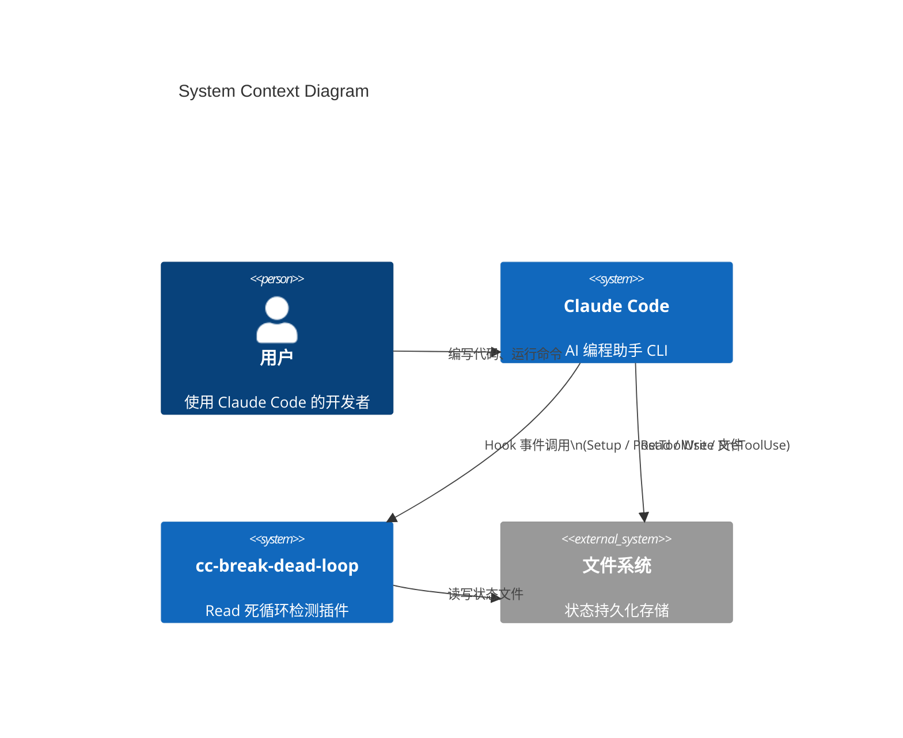

# 架构总览

## 系统上下文（C4 Level 1）

本插件作为 Claude Code 的纯观察者运行，不修改任何现有代码或接口。



## 容器架构（C4 Level 2）

```mermaid
C4Container
  title Container Diagram

  Person(user, "用户", "使用 Claude Code 的开发者")
  System_Boundary(cc, "Claude Code") {
    Container(hook_engine, "Hook 引擎", "内置", "管理 Setup / PostToolUse / PreToolUse 生命周期")
  }
  System_Boundary(plugin, "cc-break-dead-loop") {
    Container(scripts, "plugin/scripts/", "Node.js", "setup-check.mjs + node-runner.mjs")
    Container(src, "src/", "ES Module", "核心业务逻辑")
    ContainerDb(state, "状态文件", "JSON", "~/.data/cc-break-dead-loop/.../state.json")
  }
  System_Ext(filesystem, "目标文件系统", "", "被 Read 的文件")

  Rel(user, cc, "交互")
  Rel(hook_engine, scripts, "spawn 子进程\nstdin 注入 JSON")
  Rel(scripts, src, "import 并调用 main()")
  Rel(src, state, "readState / writeState")
  Rel(cc, filesystem, "Read 工具调用")
```

## 组件架构（C4 Level 3）

```mermaid
graph TB
    subgraph "plugin/scripts"
        SC[setup-check.mjs<br/>环境检测]
        NR[node-runner.mjs<br/>stdin 收集 + graceful fallback]
    end

    subgraph "src/"
        IDX[index.mjs<br/>Hook 入口 + 错误边界]
        CFG[config.mjs<br/>阈值常量]
        HND[handlers.mjs<br/>PostToolUse + PreToolUse:Read]
        ST[state.mjs<br/>状态管理 + 原子写入]
        UTL[utils.mjs<br/>sanitizeName + getProjectName]
    end

    subgraph "plugin/hooks"
        HK[hooks.json<br/>Hook 注册配置]
    end

    subgraph "文件系统"
        STATE[state.json<br/>~/.data/.../]
    end

    HK -->|Setup 事件| SC
    HK -->|PostToolUse / PreToolUse| NR
    NR -->|import main()| IDX
    IDX -->|post-tool-use| HND
    IDX -->|pre-tool-use-read| HND
    HND -->|readState / writeState| ST
    ST -->|原子写入| STATE
    HND -->|导入阈值| CFG
    ST -->|getStateDir| UTL
```

## 架构模式

### 1. 双 Hook 协作模式（Observer + Interceptor）

| Hook 类型 | 职责 | 时序 |
|-----------|------|------|
| PostToolUse | **观察** Read 结果，检测 "Wasted call" | Read 执行**后** |
| PreToolUse:Read | **拦截** 即将执行的 Read，注入警告/阻断 | Read 执行**前** |

两个 Hook 通过文件系统状态文件通信：PostToolUse 写入计数，PreToolUse:Read 读取计数并决策。

### 2. 多层降级（Defense in Depth）

```
Layer 1: hooks.json command
    └── bash 动态解析插件路径（D2）

Layer 2: node-runner.mjs
    └── stdin 超时保护（5s）
    └── 内部异常 → { continue: true } + exit(0)（D3）

Layer 3: src/index.mjs
    └── JSON 解析 try/catch
    └── handler 调用 try/catch（D5）
    └── 无效 event → { continue: true }

Layer 4: src/handlers.mjs
    └── 参数缺失 → 静默跳过
    └── 状态不存在 → 放行
```

### 3. 原子写入模式

状态文件更新采用 `writeFile(tmp) → rename(tmp, dest)`，保证并发安全：

```javascript
const tmpPath = `${filePath}.tmp.${Date.now()}`;
writeFileSync(tmpPath, JSON.stringify(state, null, 2));
renameSync(tmpPath, filePath);  // 原子操作
```

## 关键设计决策

| ID | 决策 | 理由 | 权衡 |
|----|------|------|------|
| D1 | `utils.mjs` 合并 sanitize + git | 减少文件碎片化，两个功能单一且总代码量小 | 模块粒度稍粗，但 61 行仍可维护 |
| D2 | hooks.json 使用 bash 动态解析路径 | 复用 claude-mem 模式，避免硬编码绝对路径 | 依赖 bash 可用性（Claude Code 宿主环境保证） |
| D3 | node-runner.mjs graceful fallback | 任何异常都静默降级，不阻断正常 Read | 可能隐藏真实错误，但安全性优先 |
| D4 | 不主动清理状态文件 | 自动清理引入额外复杂度，状态按 session 隔离不会无限增长 | 用户需手动清理 `~/.data/cc-break-dead-loop/` |
| D5 | Handler 统一 try/catch 边界 | 插件 bug 永不阻断正常 Read 操作 | 同上 |
| D6 | 多模式 toolResponse 检测 + JSON.stringify 兜底 | CC 的 toolResponse 格式可能因版本变化 | 稍增加性能开销，但兼容性优先 |
| D7 | `===` 直接比较参数，不规范化 `undefined→0` | 把参数规范交给 LLM 和 CC，不同调用意图不应等同 | `offset: undefined` 和 `offset: 0` 视为不同，可能导致漏检 |

## 模块分解

### src/index.mjs — Hook 入口
- **职责**：stdin 解析、handler 分发、统一错误边界
- **关键函数**：`main(event, stdinData)`
- **输入**：事件名称 + JSON 字符串（stdin）
- **输出**：JSON 对象（stdout）或 exit code 2（阻断时）

### src/handlers.mjs — 双 Handler
- **职责**：PostToolUse 检测 + PreToolUse:Read 拦截
- **关键函数**：`postToolUse(input)`、`preToolUseRead(input)`、`isWastedCall(toolResponse)`
- **输入**：HookInput（含 tool_name, tool_input, tool_response, agent_id 等）
- **输出**：`{ continue, suppressOutput }` 或阻断标记

### src/state.mjs — 状态管理
- **职责**：状态文件读写、原子写入、计数器逻辑
- **关键函数**：`getStateDir()`、`readState()`、`writeState()`、`incrementCounter()`、`isSameReadParams()`
- **状态结构**：`{ sessionId, filePath, offset, limit, consecutiveWastedReads, lastUpdatedAt }`

### src/utils.mjs — 工具函数
- **职责**：路径安全化 + Git 仓库名解析
- **关键函数**：`sanitizeName(name)`、`getProjectName(cwd)`

### src/config.mjs — 配置常量
- **职责**：集中管理阈值和数据目录
- **导出**：`WARN_THRESHOLD = 3`、`BLOCK_THRESHOLD = 5`、`DATA_DIR`

### plugin/scripts/setup-check.mjs — 环境检测
- **职责**：Setup 钩子执行，检测 Node.js >= 18 和 Git 可用性
- **特性**：永远 exit(0)，不阻断 Claude Code 启动

### plugin/scripts/node-runner.mjs — 运行时包装
- **职责**：收集 stdin，调用 main()，透传结果
- **特性**：stdin 5s 超时 + 内部异常 graceful fallback
