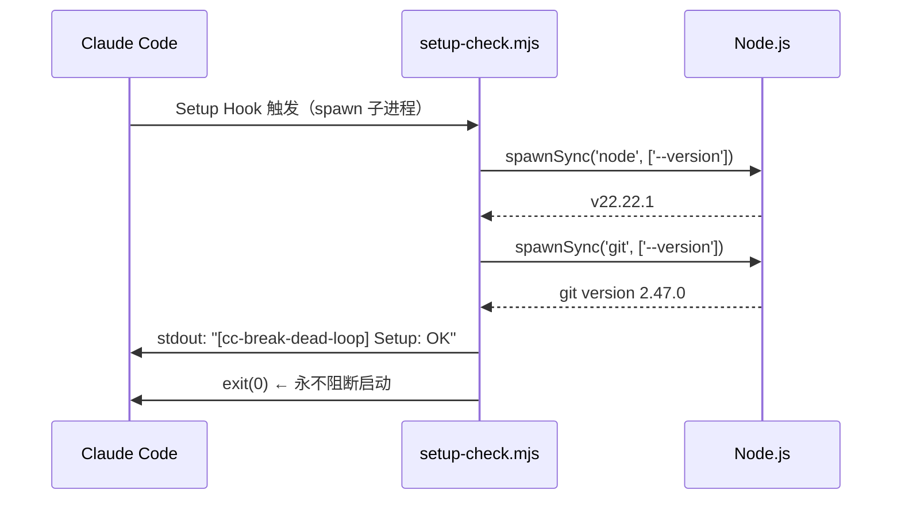
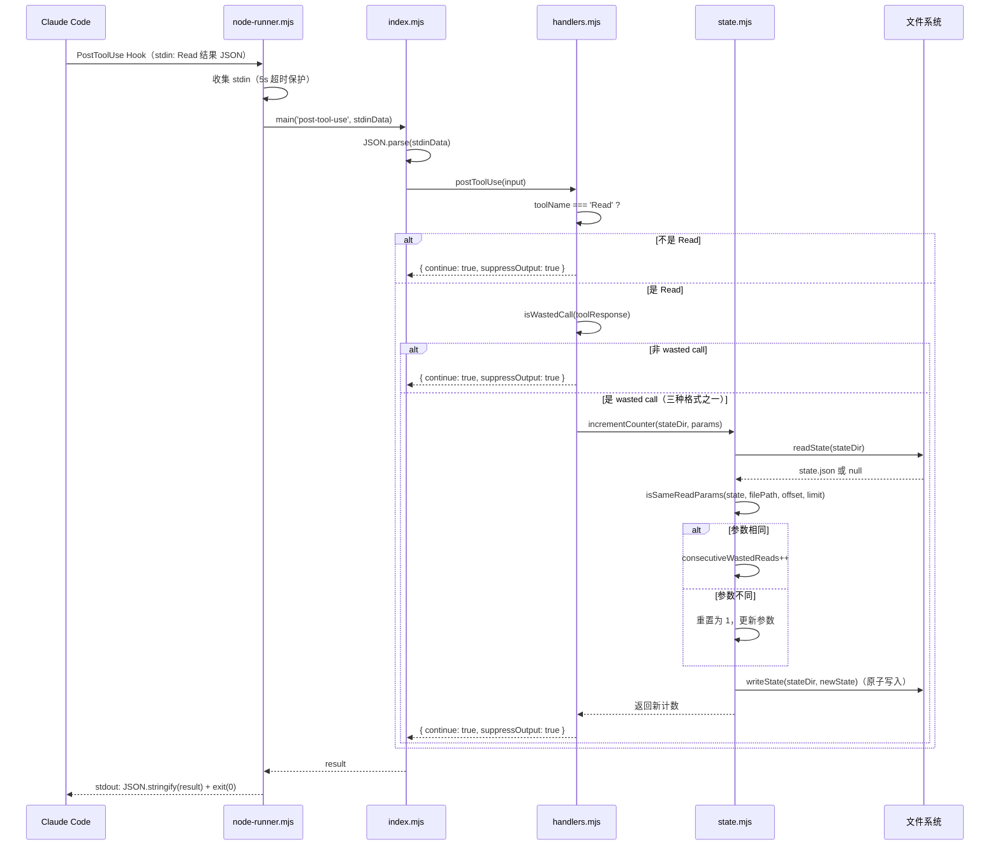
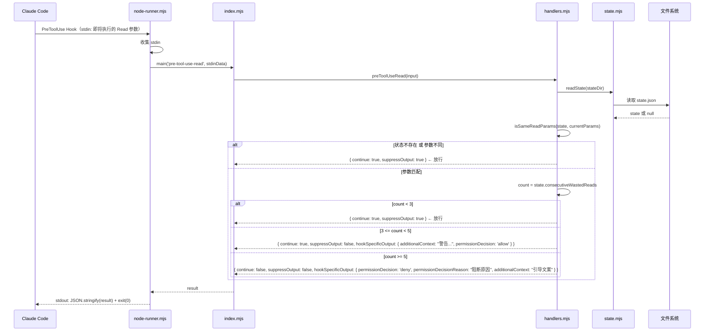
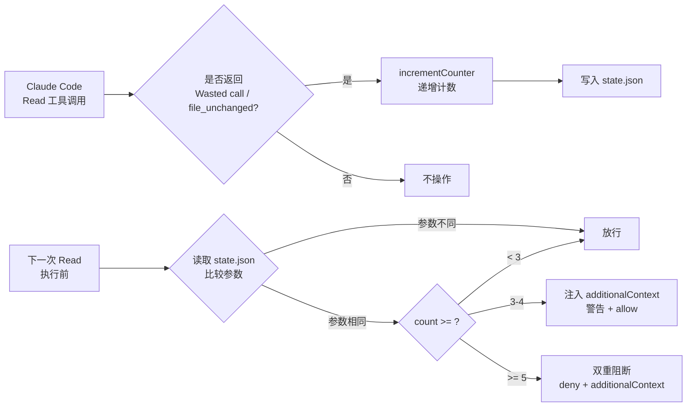
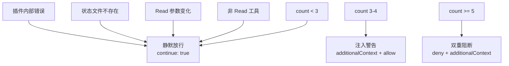

# 工作流总览

## 核心工作流

### 工作流 1：插件加载与初始化



**步骤**：
1. Claude Code 启动时加载插件，触发 Setup Hook
2. `setup-check.mjs` 检测 Node.js 是否在 PATH 且版本 >= 18
3. 可选检测 Git 是否在 PATH（用于仓库名解析）
4. 全部通过则 stdout 输出 "OK"，失败则 stderr 输出警告
5. 无论结果如何，exit(0)，永不阻断 Claude Code 启动

---

### 工作流 2：PostToolUse 检测（Read 执行后）



**步骤**：
1. Claude Code 执行 Read 工具后，触发 PostToolUse Hook
2. `node-runner.mjs` 收集 stdin，调用 `main('post-tool-use', data)`
3. `index.mjs` 解析 JSON 并分发到 `postToolUse()`
4. `handlers.mjs` 检查 toolName 是否为 "Read"，三层检测 "Wasted call"
5. 若检测到 wasted call，调用 `incrementCounter()` 更新状态
6. 状态管理模块比较当前 Read 参数与状态记录，相同则递增，不同则重置
7. 原子写入更新后的状态文件
8. 返回 `{ continue: true, suppressOutput: true }`

---

### 工作流 3：PreToolUse:Read 拦截（Read 执行前）



**步骤**：
1. Claude Code 准备执行 Read 工具前，触发 PreToolUse Hook
2. `preToolUseRead()` 读取当前状态，比较 Read 参数
3. 若参数不匹配或状态不存在，直接放行（`continue: true`）
4. 若参数匹配，根据计数器值决策：
   - `< 3`：放行
   - `>= 3 且 < 5`：注入 `additionalContext` 警告 + `permissionDecision: 'allow'`，允许执行
   - `>= 5`：双重阻断保险 —— `permissionDecision: 'deny'`（主 agent 强制阻断）+ `additionalContext`（引导 subagent/teammate 停止）

---

## 数据流



## 状态管理

### 状态隔离维度

状态文件按三层目录结构隔离：

```
~/.data/cc-break-dead-loop/
  └─ <safe-project-name>/          ← Git 仓库名 或 cwd 文件夹名
      └─ <session-id>/              ← Claude Code 会话 ID
          └─ <safe-agent-name>/     ← agent_id（空值为 "main"）
              └─ state.json
```

### 状态文件结构

```json
{
  "sessionId": "sess-abc-123",
  "filePath": "/Users/lionad/project/src/main.ts",
  "offset": 10,
  "limit": 50,
  "consecutiveWastedReads": 4,
  "lastUpdatedAt": "2026-05-10T05:30:00.000Z"
}
```

### 计数器重置规则

当 Read 参数任一变化时，计数器重置为 1：
- `file_path` 变化（读取不同文件）
- `offset` 变化（读取不同位置）
- `limit` 变化（读取不同行数）

**注意**：`offset: undefined` 和 `offset: 0` 被视为不同参数（D7 决策），不会相互重置。

## 错误处理

### 分级错误边界

| 层级 | 处理者 | 行为 | 场景 |
|------|--------|------|------|
| L1 | node-runner.mjs | 异常 → `{ continue: true }` + exit(0) | runner 自身崩溃 |
| L2 | index.mjs | JSON 解析失败 → `{ continue: true }` | stdin 非有效 JSON |
| L3 | index.mjs | handler 抛出 → `{ continue: true }` | handler 内部 bug |
| L4 | handlers.mjs | 参数缺失 → 静默跳过 | tool_input 缺少 file_path |
| L5 | state.mjs | 读取失败 → 返回 null | 状态文件不存在或损坏 |

### 阻断 vs 放行



## 工具响应检测策略（D6）

```mermaid
flowchart TD
  A[toolResponse] --> B{typeof}
  B -->|string| C[includes "Wasted call"?]
  B -->|object| D{type === "file_unchanged"?}
  D -->|是| F[命中]
  D -->|否| E[content?.includes "Wasted call"?]
  B -->|其他| G[JSON.stringify<br/>后 includes?]
  C -->|是| F
  C -->|否| H[未命中]
  E -->|是| F
  E -->|否| G
  G -->|是| F
  G -->|否| H
```

**三层检测说明**：

1. **字符串**：`"Wasted call — file unchanged"` — 兼容旧版
2. **`file_unchanged` 对象**：`{ type: "file_unchanged", file: { filePath } }` — Claude Code 实际返回格式
3. **`content` 对象 + `JSON.stringify` 兜底**：`{ content: "Wasted call..." }` 或嵌套对象序列化后搜索
