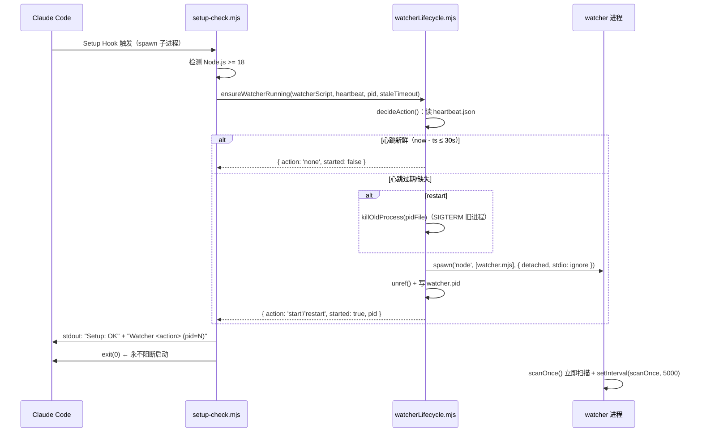
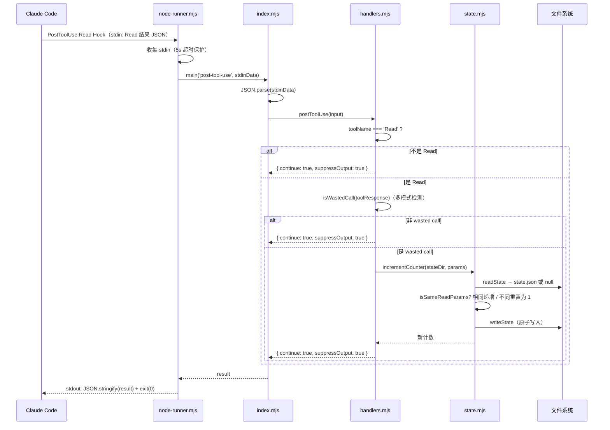
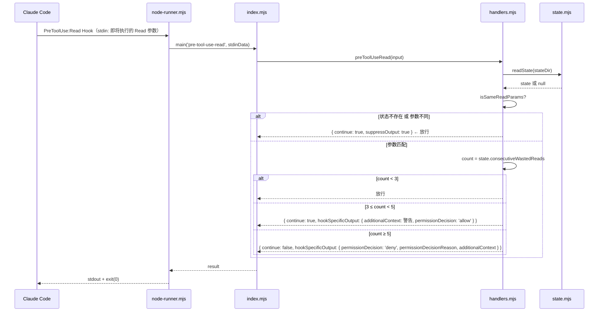
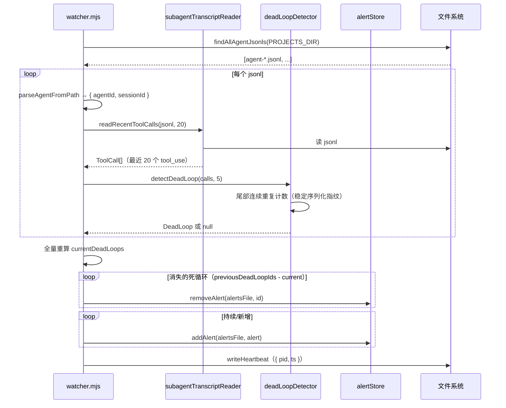
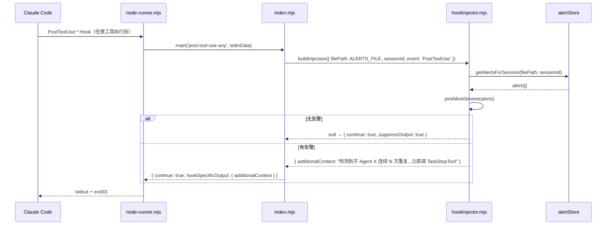
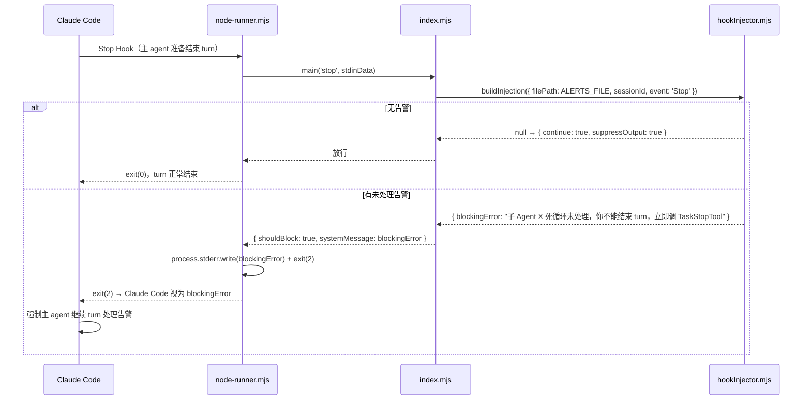
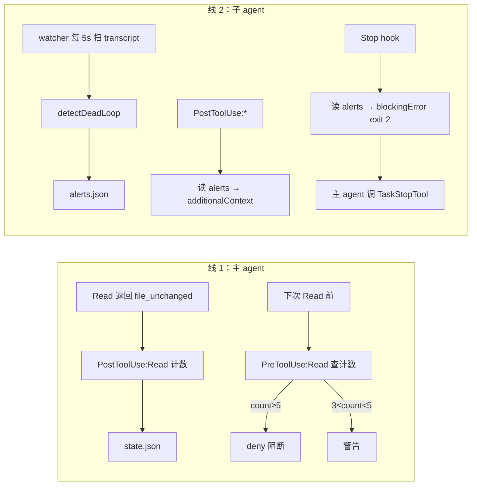
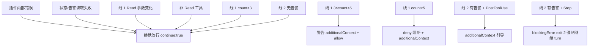

# 工作流总览

本项目用**双线机制**处理两类死循环。线 1 处理主 agent Read 死循环（双 Hook），线 2 处理子 agent 工具死循环（watcher + Stop/PostToolUse:`*` 注入）。

## 线 1 工作流（主 agent Read 死循环）

### 工作流 1：插件加载与 watcher 保活（Setup）



**步骤**：
1. Claude Code 启动加载插件，触发 Setup Hook
2. `setup-check.mjs` 检测 Node.js >= 18
3. `ensureWatcherRunning` 读心跳决策：新鲜则跳过，过期/缺失则（restart 时先 kill 旧进程）detached spawn watcher
4. watcher 立即扫描一次，随后每 5s 扫描
5. 无论 watcher 是否成功，`exit(0)` 永不阻断 Claude Code

### 工作流 2：PostToolUse:Read 检测（Read 执行后）



### 工作流 3：PreToolUse:Read 拦截（Read 执行前）



## 线 2 工作流（子 agent 工具死循环）

### 工作流 4：watcher 扫描（常驻进程，每 5s）



**步骤**：
1. watcher 每 5s 触发 `scanOnce`
2. 递归收集所有 `agent-*.jsonl`
3. 每个 jsonl 提取最近 20 个 tool_use，检测尾部连续重复是否 ≥ 5
4. 全量重算当前死循环集合，对比上次：消失的 `removeAlert`，新增/持续的 `addAlert`
5. 写心跳

### 工作流 5：PostToolUse:\* 注入告警（任意工具后）



### 工作流 6：Stop hook 阻断（主 agent 结束 turn）



**关键**：Stop hook 用 `exit(2)` + stderr 触发 Claude Code 的 blockingError 机制，强制主 agent 不能结束 turn，必须先调用 `TaskStopTool` 终止死循环子 agent。

## 数据流总览



## 状态/数据管理

### 数据文件布局

```
~/.data/cc-break-dead-loop/            （可由 CC_BREAK_DATA_DIR 覆盖）
  ├─ <safe-project>/<session>/<agent>/
  │   └─ state.json                    # 线 1：主 agent Read 计数
  ├─ alerts.json                       # 线 2：子 agent 死循环告警（watcher 写 / hooks 读）
  ├─ watcher-heartbeat.json            # watcher 心跳（{ pid, ts }）
  └─ watcher.pid                       # watcher PID（重启时 kill）

~/.claude/projects/                    （可由 CC_BREAK_PROJECTS_DIR 覆盖）
  └─ <project>/<session>/subagents/
      └─ agent-<id>.jsonl              # watcher 扫描输入（Claude Code 生成，只读）
```

### state.json（线 1）

```json
{
  "sessionId": "sess-abc",
  "filePath": "/path/file.ts",
  "offset": 10,
  "limit": 50,
  "consecutiveWastedReads": 4,
  "lastUpdatedAt": "2026-06-14T03:00:00.000Z"
}
```

计数器重置规则：`filePath` / `offset` / `limit` 任一变化即重置为 1。`offset: undefined` 与 `offset: 0` 视为不同（D7）。

### alerts.json（线 2）

```json
{
  "version": 1,
  "alerts": [
    {
      "taskId": "agent-xyz",
      "sessionId": "sess-abc",
      "toolName": "Read",
      "paramFingerprint": "{\"file_path\":\"/a/b\"}",
      "repeatCount": 7,
      "detectedAt": "2026-06-14T03:00:00.000Z"
    }
  ]
}
```

多 session 通过 `sessionId` 字段过滤隔离，单文件原子写入。`taskId` = agentId，upsert 覆盖。

### watcher-heartbeat.json

```json
{ "pid": 12345, "ts": 1718300000000 }
```

`watcherLifecycle.decideAction` 据此判断：`now - ts > 30000` → restart。

## 错误处理

### 分级错误边界

| 层级 | 处理者 | 行为 | 场景 |
|------|--------|------|------|
| L1 | node-runner.mjs | 异常 → `{ continue: true }` + exit(0) | runner 自身崩溃 |
| L2 | index.mjs | JSON 解析失败 / handler 抛出 → `{ continue: true }` | stdin 非法 / handler bug |
| L3 | handlers.mjs | 参数缺失 → 静默跳过 | tool_input 缺 file_path |
| L4 | state.mjs / alertStore.mjs | 读失败返回 null/[] | 文件不存在/损坏 |
| L5 | watcher.mjs | 扫描异常跳过损坏 jsonl | transcript 格式异常 |
| L6 | watcherLifecycle | 心跳过期 → 下次 Setup restart | watcher 崩溃 |
| L7 | setup-check.mjs | watcher 启动失败仅 console.error，exit(0) | spawn 失败 |

### 阻断 vs 放行



## 工具响应检测策略（线 1，D6）

```mermaid
flowchart TD
  A[toolResponse] --> B{typeof}
  B -->|string| C[includes "Wasted call"?]
  B -->|object| D{type === "file_unchanged"?}
  D -->|是| F[命中]
  D -->|否| E[content?.includes "Wasted call"?]
  B -->|其他| G[JSON.stringify 后 includes?]
  C -->|是| F
  C -->|否| H[未命中]
  E -->|是| F
  E -->|否| G
  G -->|是| F
  G -->|否| H
```

**三层检测**：字符串 `"Wasted call"` / `{ type: "file_unchanged" }` 对象 / `content` 字段 / `JSON.stringify` 兜底，兼容 Claude Code 版本变更。

## 死循环检测算法（线 2，W1/W4）

`deadLoopDetector.detectDeadLoop(calls, threshold)`：

1. 取序列最后一个 call，计算其 `stableStringify(input)` 指纹
2. 从尾部向前回溯，统计 `toolName` 相同且指纹相同的连续 call 数
3. 一旦遇到不同 call（工具名或参数变化）立即停止回溯
4. `count >= threshold` → 返回 `{ toolName, paramFingerprint, repeatCount }`，否则 null

**稳定序列化**：递归对对象键排序后 stringify，使 `{a:1,b:2}` 与 `{b:2,a:1}` 产生相同指纹。
