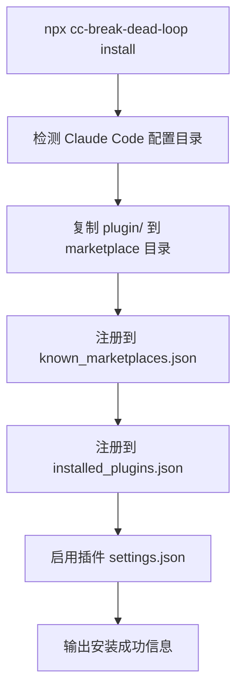

# Deep Dive: Plugin Registration — 插件注册

## 概述

Claude Code 插件通过 `plugin/` 目录下的配置文件注册到 Hook 引擎。本插件注册三种 Hook：Setup、PostToolUse、PreToolUse。

## 文件结构

```
plugin/
├── .claude-plugin/
│   └── plugin.json          # 插件元数据
├── hooks/
│   └── hooks.json           # Hook 注册配置
├── src/                     # 核心源码
│   ├── index.mjs            # Hook 入口
│   ├── config.mjs           # 配置常量
│   ├── handlers.mjs         # 双 Handler
│   ├── state.mjs            # 状态管理
│   └── utils.mjs            # 工具函数
└── scripts/
    ├── node-runner.mjs      # PostToolUse/PreToolUse 运行时
    └── setup-check.mjs      # Setup 环境检测
```

## plugin.json — 插件元数据

```json
{
  "name": "cc-break-dead-loop",
  "version": "0.1.5",
  "description": "Claude Code 插件：自动检测并打断 agent 对同一未改动文件的连续 Read 死循环",
  "author": {
    "name": "仿生狮子"
  },
  "license": "MIT",
  "repository": "https://github.com/Lionad-Morotar/cc-break-dead-loop",
  "homepage": "https://github.com/Lionad-Morotar/cc-break-dead-loop#readme"
}
```

这是 Claude Code 识别插件的基础信息，不含技术配置。

## hooks.json — Hook 注册

```json
{
  "hooks": {
    "Setup": [
      {
        "matcher": "*",
        "hooks": [
          {
            "type": "command",
            "command": "bash -c 'node \"${CLAUDE_PLUGIN_ROOT}/scripts/setup-check.mjs\"'"
          }
        ]
      }
    ],
    "PostToolUse": [
      {
        "matcher": "Read",
        "hooks": [
          {
            "type": "command",
            "command": "bash -c 'node \"${CLAUDE_PLUGIN_ROOT}/scripts/node-runner.mjs\" post-tool-use'"
          }
        ]
      }
    ],
    "PreToolUse": [
      {
        "matcher": "Read",
        "hooks": [
          {
            "type": "command",
            "command": "bash -c 'node \"${CLAUDE_PLUGIN_ROOT}/scripts/node-runner.mjs\" pre-tool-use-read'"
          }
        ]
      }
    ]
  }
}
```

### Hook 配置解析

| 字段 | Setup | PostToolUse | PreToolUse |
|------|-------|-------------|------------|
| `hook` | Setup | PostToolUse | PreToolUse |
| `matcher` | `*`（所有） | Read | Read |
| `command` | 运行 setup-check.mjs | 运行 node-runner.mjs post-tool-use | 运行 node-runner.mjs pre-tool-use-read |

### 动态路径解析（D2 决策）

```bash
node "${CLAUDE_PLUGIN_ROOT}/scripts/node-runner.mjs"
```

**逻辑**：
- `CLAUDE_PLUGIN_ROOT` 由 Claude Code 自动设置为插件根目录（`plugin/`）
- 所有脚本通过该变量定位，无需硬编码绝对路径

这使插件可以从任意安装位置加载。

### 为什么用 bash 而非直接写 node 命令？

bash 层负责：
1. **环境变量展开**：`${CLAUDE_PLUGIN_ROOT}` 需要 shell 展开
2. **路径规范化**：确保得到正确的绝对路径
3. **兼容性**：Claude Code hook command 字段要求 shell 命令

## node-runner.mjs — 运行时包装

```javascript
import { main } from '../src/index.mjs';

const event = process.argv[2];
let data = '';

const timeout = setTimeout(() => { finish(); }, 5000);

process.stdin.setEncoding('utf8');
process.stdin.on('data', (chunk) => { data += chunk; });
process.stdin.on('end', finish);
process.stdin.on('error', handleError);

async function finish() {
  clearTimeout(timeout);
  try {
    const result = await main(event, data);
    console.log(JSON.stringify(result));
    process.exit(0);
  } catch {
    handleError();
  }
}

function handleError() {
  clearTimeout(timeout);
  console.log(JSON.stringify({ continue: true, suppressOutput: true }));
  process.exit(0);
}
```

### 设计要点

**stdin 超时保护**：
```javascript
const timeout = setTimeout(() => { finish(); }, 5000);
```
若 stdin 5 秒内未结束，强制继续处理（可能 data 为空，但 `main()` 会处理）。

**Graceful Fallback（D3）**：
任何异常都输出 `{ continue: true }` 并 exit(0)，确保插件问题不阻断正常 Read。

**统一结果透传**：
当前版本不再在 runner 层处理 `shouldBlock`，而是将 handler 返回的完整结构（含 `hookSpecificOutput`）直接 JSON.stringify 输出。Claude Code 根据 `permissionDecision` 字段自行决定是否阻断。

### 为什么需要 runner 层？

`node-runner.mjs` 是 Claude Code Hook 协议与 `plugin/src/index.mjs` 之间的**适配层**：
- Claude Code 通过 `command` 字段 spawn 子进程，stdin 注入 JSON
- runner 负责收集 stdin、调用 `main()`、处理输出格式
- runner 提供第一层错误边界，与 `index.mjs` 的第二层形成冗余防护

## setup-check.mjs — 环境检测

```javascript
function checkNode() {
  const result = spawnSync('node', ['--version'], { encoding: 'utf8' });
  if (result.error || result.status !== 0) {
    return { ok: false, message: 'Node.js 未安装或不在 PATH 中' };
  }
  const version = result.stdout.trim();
  const majorMatch = version.match(/v(\d+)/);
  if (!majorMatch) {
    return { ok: false, message: `无法解析 Node.js 版本: ${version}` };
  }
  const major = parseInt(majorMatch[1], 10);
  if (major < 18) {
    return { ok: false, message: `Node.js 版本 ${version} 过低，需要 >= v18.0.0` };
  }
  return { ok: true, message: `Node.js ${version}` };
}
```

### 设计要点

**Setup 永不阻断**：
```javascript
process.exit(0);  // 无论检测结果如何
```

即使 Node.js 未安装，Claude Code 也能正常启动，只是插件不生效。

**渐进式信息**：
- Node.js OK → stdout: `[cc-break-dead-loop] Setup: OK (Node.js v22.22.1)`
- Node.js 失败 → stderr: 具体错误 + 安装提示
- Git 缺失 → stderr: 可选提示（不影响核心功能）

## 安装机制

### 方式一：Marketplace 安装（推荐）

通过 Claude Code 的 marketplace 机制安装：

```bash
# 在 Claude Code CLI 中
/plugins add lionad-morotar
```

Marketplace 配置由项目根目录 `.claude-plugin/marketplace.json` 定义。

### 方式二：NPX CLI 安装

```bash
npx cc-break-dead-loop install
```

安装流程：



该命令执行以下步骤：
1. 检测 Claude Code 配置目录是否存在
2. 复制 `plugin/` 到 `~/.claude/marketplace/lionad-morotar/plugin/`
3. 注册 marketplace 到 `known_marketplaces.json`
4. 注册插件到 `installed_plugins.json`
5. 启用插件（写入 `settings.json` 的 `enabledPlugins`）

### 方式三：手动安装

```bash
mkdir -p ~/.claude/plugins/cc-break-dead-loop
cp -r plugin/* ~/.claude/plugins/cc-break-dead-loop/
```

### 其他 CLI 命令

```bash
npx cc-break-dead-loop status           # 查看安装状态
npx cc-break-dead-loop uninstall        # 卸载插件
npx cc-break-dead-loop uninstall --purge  # 卸载并删除 marketplace 目录
npx cc-break-dead-loop version          # 显示版本号
```
