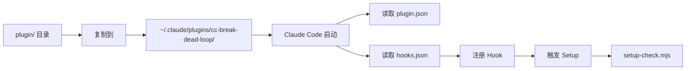

# Deep Dive: Plugin Registration — 插件注册

## 概述

Claude Code 插件通过 `plugin/` 目录下的配置文件注册到 Hook 引擎。本插件注册三种 Hook：Setup、PostToolUse、PreToolUse。

## 文件结构

```
plugin/
├── .claude-plugin/
│   └── plugin.json          # 插件元数据
├── hooks/
│   └── hooks.json           # Hook 注册配置
└── scripts/
    ├── node-runner.mjs      # PostToolUse/PreToolUse 运行时
    └── setup-check.mjs      # Setup 环境检测
```

## plugin.json — 插件元数据

```json
{
  "name": "cc-break-dead-loop",
  "version": "0.1.0",
  "description": "Claude Code 插件：自动检测并打断 agent 对同一未改动文件的连续 Read 死循环",
  "author": "仿生狮子",
  "license": "MIT"
}
```

这是 Claude Code 识别插件的基础信息，不含技术配置。

## hooks.json — Hook 注册

```json
{
  "hooks": [
    {
      "hook": "Setup",
      "matcher": "*",
      "command": "bash -c 'PLUGIN_ROOT=${CLAUDE_PLUGIN_ROOT:-$(cd \"$(dirname \"$0\")/../..\" && pwd)}; node \"$PLUGIN_ROOT/plugin/scripts/setup-check.mjs\"'"
    },
    {
      "hook": "PostToolUse",
      "matcher": "Read",
      "command": "bash -c 'PLUGIN_ROOT=${CLAUDE_PLUGIN_ROOT:-$(cd \"$(dirname \"$0\")/../..\" && pwd)}; node \"$PLUGIN_ROOT/plugin/scripts/node-runner.mjs\" post-tool-use'"
    },
    {
      "hook": "PreToolUse",
      "matcher": "Read",
      "command": "bash -c 'PLUGIN_ROOT=${CLAUDE_PLUGIN_ROOT:-$(cd \"$(dirname \"$0\")/../..\" && pwd)}; node \"$PLUGIN_ROOT/plugin/scripts/node-runner.mjs\" pre-tool-use-read'"
    }
  ]
}
```

### Hook 配置解析

| 字段 | Setup | PostToolUse | PreToolUse |
|------|-------|-------------|------------|
| `hook` | Setup | PostToolUse | PreToolUse |
| `matcher` | `*`（所有） | Read | Read |
| `command` | 运行 setup-check.mjs | 运行 node-runner.mjs post-tool-use | 运行 node-runner.mjs pre-tool-use-read |

### 动态路径解析（D2 决策）

```bash
PLUGIN_ROOT=${CLAUDE_PLUGIN_ROOT:-$(cd "$(dirname "$0")/../.." && pwd)}
```

**逻辑**：
1. 优先检查 `CLAUDE_PLUGIN_ROOT` 环境变量（开发时使用）
2. 否则从脚本路径向上推算插件根目录：`scripts/` → `plugin/` → 项目根目录

这避免了硬编码绝对路径，使插件可以从任意安装位置加载。

### 为什么用 bash 而非直接写 node 命令？

bash 层负责：
1. **动态解析插件根目录**：不同用户的安装路径不同
2. **环境变量支持**：开发时通过 `CLAUDE_PLUGIN_ROOT` 覆盖
3. **路径规范化**：`cd && pwd` 确保得到绝对路径

## node-runner.mjs — 运行时包装

```javascript
import { main } from '../../src/index.mjs';

const event = process.argv[2];
let data = '';

const timeout = setTimeout(() => { finish(); }, 5000);

process.stdin.setEncoding('utf8');
process.stdin.on('data', (chunk) => { data += chunk; });
process.stdin.on('end', finish);
process.stdin.on('error', handleError);

async function finish() {
  clearTimeout(timeout);
  try {
    const result = await main(event, data);
    if (result?.shouldBlock) {
      console.log(JSON.stringify({ systemMessage: result.systemMessage }));
      process.exit(2);
    }
    console.log(JSON.stringify(result));
    process.exit(0);
  } catch {
    handleError();
  }
}

function handleError() {
  clearTimeout(timeout);
  console.log(JSON.stringify({ continue: true, suppressOutput: true }));
  process.exit(0);
}
```

### 设计要点

**stdin 超时保护**：
```javascript
const timeout = setTimeout(() => { finish(); }, 5000);
```
若 stdin 5 秒内未结束，强制继续处理（可能 data 为空，但 `main()` 会处理）。

**Graceful Fallback（D3）**：
任何异常都输出 `{ continue: true }` 并 exit(0)，确保插件问题不阻断正常 Read。

**阻断标记处理**：
```javascript
if (result?.shouldBlock) {
  console.log(JSON.stringify({ systemMessage: result.systemMessage }));
  process.exit(2);
}
```

阻断时只输出 `systemMessage` 字段，exit code 2 是 Claude Code 的 blocking error 语义。

### 为什么需要 runner 层？

`node-runner.mjs` 是 Claude Code Hook 协议与 `src/index.mjs` 之间的**适配层**：
- Claude Code 通过 `command` 字段 spawn 子进程，stdin 注入 JSON
- runner 负责收集 stdin、调用 `main()`、处理输出格式
- runner 提供第一层错误边界，与 `index.mjs` 的第二层形成冗余防护

## setup-check.mjs — 环境检测

```javascript
function checkNode() {
  const result = spawnSync('node', ['--version'], { encoding: 'utf8' });
  if (result.error || result.status !== 0) {
    return { ok: false, message: 'Node.js 未安装或不在 PATH 中' };
  }
  const version = result.stdout.trim();
  const majorMatch = version.match(/v(\d+)/);
  if (!majorMatch) {
    return { ok: false, message: `无法解析 Node.js 版本: ${version}` };
  }
  const major = parseInt(majorMatch[1], 10);
  if (major < 18) {
    return { ok: false, message: `Node.js 版本 ${version} 过低，需要 >= v18.0.0` };
  }
  return { ok: true, message: `Node.js ${version}` };
}
```

### 设计要点

**Setup 永不阻断**：
```javascript
process.exit(0);  // 无论检测结果如何
```

即使 Node.js 未安装，Claude Code 也能正常启动，只是插件不生效。

**渐进式信息**：
- Node.js OK → stdout: `[cc-break-dead-loop] Setup: OK (Node.js v22.22.1)`
- Node.js 失败 → stderr: 具体错误 + 安装提示
- Git 缺失 → stderr: 可选提示（不影响核心功能）

## 安装机制



### 开发模式

通过 `CLAUDE_PLUGIN_ROOT` 环境变量，开发时无需反复复制：

```bash
export CLAUDE_PLUGIN_ROOT=/path/to/cc-break-dead-loop
```

`hooks.json` 中的 bash 命令会优先使用该路径。
