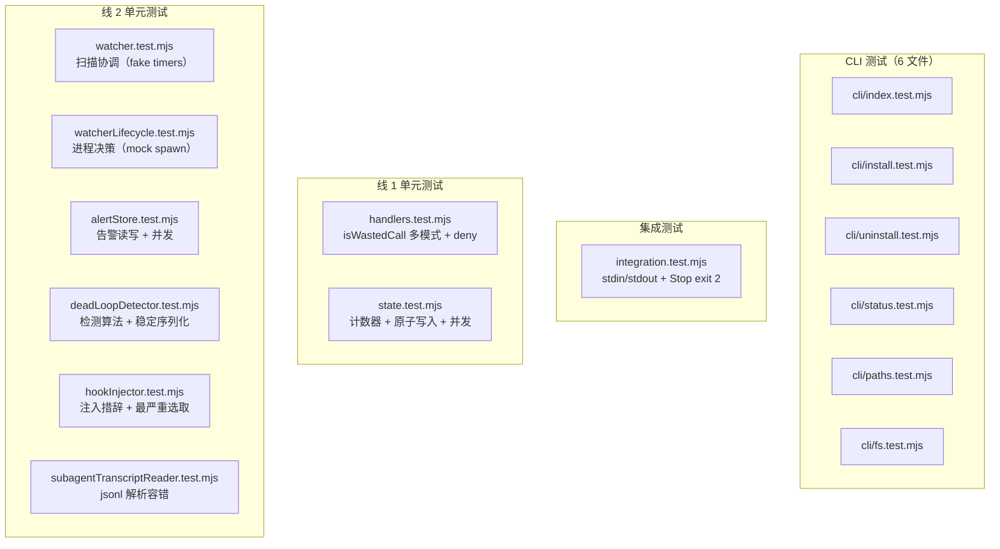

# Deep Dive: Testing — 测试体系

## 概述

测试套件使用 **Vitest ^4.1.8**（devDependency），断言仍用 `node:assert`。共 **135 项测试 / 15 文件**，覆盖线 1（主 agent Read 死循环）、线 2（子 agent 工具死循环 watcher 子系统）、CLI 工具、端到端集成四个层次。

从 `node:test` 迁移到 vitest 的动机：线 2 watcher 测试需要 fake timers（`vi.useFakeTimers`）+ 模块 mock（`vi.mock('node:fs')` / `vi.mock('node:child_process')`），`node:test` 无内置支持。

```bash
npm test                         # = vitest run（135 用例）
npm run test:watch               # vitest watch 模式
npx vitest run tests/watcher.test.mjs   # 单文件
npx vitest -t "sanitizeName"            # 按名过滤
```

## 测试金字塔



## 线 1 测试

### handlers.test.mjs — Handler 逻辑

| 领域 | 关键场景 |
|------|----------|
| `isWastedCall` | 字符串 / `file_unchanged` 对象 / content 对象 / 嵌套对象兜底 / null / 数字 |
| `postToolUse` | 正常内容 / 非 Read / 缺 file_path / 三种 wasted call 格式 |
| `preToolUseRead` | 状态不存在放行 / count=2 放行 / count=3 警告 / count=5 deny+additionalContext / 参数变化放行（D7）|

### state.test.mjs — 状态管理

| 领域 | 关键场景 |
|------|----------|
| `sanitizeName` | 保留字符 / 去首尾连字符 / 空结果 fallback / 64 字符截断 |
| `getProjectName` | git 仓库 / 无 git 目录 / 空路径 |
| `getStateDir` | 路径构建 / agent_id 空用 main |
| `incrementCounter` | 连续递增 / 参数变化重置 / undefined vs 0（D7）/ 并发不损坏 |
| `isSameReadParams` | 相同 / 不同 / undefined vs 0 / null |

**测试隔离**：`baseInput` 固定参数模板，不同 `session_id`/`agent_id` 隔离状态文件。

## 线 2 测试

### watcher.test.mjs — 扫描协调

| 场景 | 验证点 |
|------|--------|
| 检测尾部连续重复 ≥ threshold | 写死循环 jsonl → scanOnce → alerts.json 有告警 |
| 增量同步（消失的 removeAlert） | 子 agent 停止重复后，下次扫描告警被移除（W4）|
| 定时扫描 | `vi.useFakeTimers` + `vi.advanceTimersByTime(5000)` 触发扫描 |
| 心跳写入 | scanOnce 后 heartbeat.json 含 pid + ts |

**辅助函数**：`assistantLine(toolName, input)` 构造 assistant tool_use 行；`writeAgentJsonl(root, project, session, agentId, lines)` 在 tmpDir 构造 `projects/<proj>/<session>/subagents/agent-<id>.jsonl`。

### watcherLifecycle.test.mjs — 进程决策

| 场景 | 验证点 |
|------|--------|
| `decideAction` 三态 | 心跳新鲜 → none / 过期 → restart / 无心跳 → start |
| `ensureWatcherRunning` spawn | `vi.mock('node:child_process')` 验证 detached spawn + unref + PID 写入 |
| restart 时 kill 旧进程 | 验证 `process.kill(pid, 'SIGTERM')` 调用 |

### deadLoopDetector.test.mjs — 检测算法

| 场景 | 验证点 |
|------|--------|
| 尾部连续重复达阈值 | 返回 `{ toolName, paramFingerprint, repeatCount }` |
| 尾部被打断 | 历史 repeated 段不报（只看当前段）|
| 稳定序列化 | `{a:1,b:2}` 与 `{b:2,a:1}` 产生相同指纹 |
| 空序列 / 阈值未达 | 返回 null |

### alertStore.test.mjs — 告警存储

| 场景 | 验证点 |
|------|--------|
| `addAlert` upsert | 同 taskId 覆盖，不同 taskId 追加 |
| `removeAlert` | 删除指定 taskId，不存在时静默 |
| `getAlertsForSession` | sessionId 过滤 + 可选 agentId 过滤 |
| 并发写入 | 原子写入（tmp + rename），文件始终合法 JSON |

### hookInjector.test.mjs — 注入逻辑

| 场景 | 验证点 |
|------|--------|
| `buildInjection` PostToolUse | 返回 `{ additionalContext }`，文案含 taskId / repeatCount / TaskStopTool |
| `buildInjection` Stop | 返回 `{ blockingError }`，文案含"不能结束 turn" |
| 无告警 | 返回 null |
| `pickMostSevere` | 选 repeatCount 最大的告警 |

### subagentTranscriptReader.test.mjs — jsonl 解析

| 场景 | 验证点 |
|------|--------|
| 正常解析 | 提取 assistant 行的 tool_use block |
| 容错 | 跳过非 assistant 行 / JSON 解析失败行 / content 非数组行 |
| windowSize 截断 | 返回最近 N 个 tool_use |
| 文件不存在 | 返回空数组 |

## 集成测试

### integration.test.mjs — stdin/stdout 协议

通过 `spawn` 子进程运行真实 `node-runner.mjs` / `index.mjs`：

| 场景 | 验证点 |
|------|--------|
| PostToolUse:Read 正常 | exit 0, `continue: true` |
| PostToolUse:Read wasted call | 计数器更新 |
| PreToolUse:Read count≥5 | `permissionDecision: 'deny'` |
| PostToolUse:any 无告警 | `continue: true` |
| Stop 有告警 | `exit 2`，stderr 含 blockingError |
| 无效 event | exit 0, `continue: true` |
| stdin 空/非法 JSON | exit 0, `continue: true`（D5）|
| setup-check OK | stdout 含 "OK" |
| 直接运行 index.mjs CLI | 正确处理 stdin |

## CLI 测试

| 文件 | 关键场景 |
|------|----------|
| `cli/index.test.mjs` | parseArgs / showHelp / showVersion |
| `cli/install.test.mjs` | 全新安装 / 覆盖安装 / CC 未安装报错 / 配置格式异常 / enabledPlugins 缺失创建 |
| `cli/uninstall.test.mjs` | 正常卸载 / --purge / 未安装 / enabledPlugins 清空 |
| `cli/status.test.mjs` | 全 ✓ / 未安装 / 部分异常 |
| `cli/paths.test.mjs` | 各路径常量 / CLAUDE_CONFIG_DIR 环境变量 |
| `cli/fs.test.mjs` | readJsonFile / writeJsonFile / copyDir（深度限制、跳过符号链接）|

CLI 测试用 `mkdtempSync(tmpdir())` + `process.env.CLAUDE_CONFIG_DIR = tmpDir` 隔离，不污染真实配置。

## 测试设计原则

### 1. 纯函数优先

`isWastedCall`、`detectDeadLoop`、`buildInjection`、`decideAction` 设计为纯函数，便于单元测试。副作用（文件 I/O、进程 spawn）集中在可 mock 的模块。

### 2. 临时目录隔离

```javascript
const tmpDir = mkdtempSync(join(tmpdir(), `cc-break-dead-loop-<scope>-test-${Date.now()}`));
```

每个测试独立临时目录，`afterEach` 清理。

### 3. 分层 mock 策略

| 测试对象 | 策略 |
|----------|------|
| 纯函数（detector、handlers、injector）| 不 mock |
| 文件系统（state、alertStore、watcher）| 真实 tmp 目录 |
| 定时器（watcher）| `vi.useFakeTimers` + `vi.advanceTimersByTime` |
| 进程 spawn（lifecycle）| `vi.mock('node:child_process')` |
| CLI | 真实 tmp `CLAUDE_CONFIG_DIR` |

### 4. 子进程集成测试

`spawn` 启动真实子进程，验证完整 stdin/stdout 协议、exit code（含 Stop 的 exit 2）、超时处理、错误降级。

### 5. 并发安全验证

`incrementCounter` / `addAlert` 的并发测试验证原子写入下文件始终合法 JSON。

## 覆盖率统计

| 模块 | 测试文件 | 覆盖场景 |
|------|----------|----------|
| `utils.mjs` | state.test.mjs | sanitizeName / getProjectName |
| `state.mjs` | state.test.mjs | 全部导出函数 + 并发 |
| `handlers.mjs` | handlers.test.mjs | isWastedCall / postToolUse / preToolUseRead |
| `index.mjs` | integration.test.mjs | 4 事件分发 / Stop 阻断 / 错误边界 |
| `node-runner.mjs` | integration.test.mjs | 协议 / Stop exit 2 / 降级 |
| `setup-check.mjs` | integration.test.mjs | 环境检测 |
| `watcher.mjs` | watcher.test.mjs | 扫描协调 / 增量同步 / 心跳 |
| `watcherLifecycle.mjs` | watcherLifecycle.test.mjs | decideAction / spawn |
| `deadLoopDetector.mjs` | deadLoopDetector.test.mjs | 检测算法 / 稳定序列化 |
| `alertStore.mjs` | alertStore.test.mjs | 告警读写 / 并发 |
| `hookInjector.mjs` | hookInjector.test.mjs | 注入措辞 / 最严重选取 |
| `subagentTranscriptReader.mjs` | subagentTranscriptReader.test.mjs | jsonl 解析容错 |
| `cli/*` | cli/*.test.mjs | install / uninstall / status / paths / fs / index |
| **总计** | **15 文件** | **135 项** |
