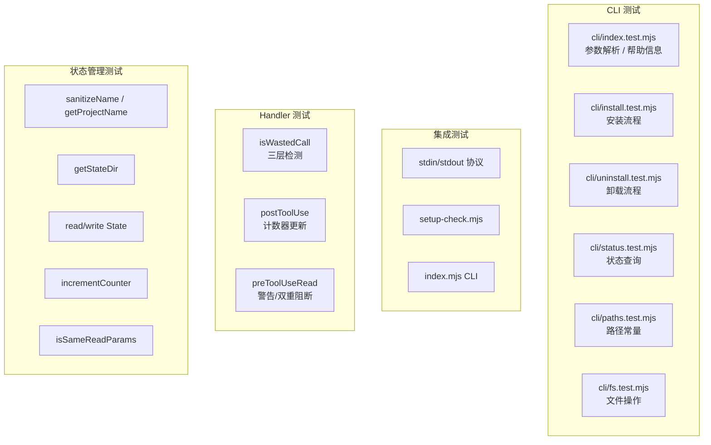

# Deep Dive: Testing — 测试体系

## 概述

测试套件使用 Node.js 18+ 内置的 `node:test` 模块和 `node:assert`，**零外部测试依赖**。共 90 项测试，覆盖状态管理、handler 逻辑、端到端集成、CLI 工具四个层次。

```bash
# 运行全部测试
npm test

# 或指定文件
node --test tests/state.test.mjs
```

## 测试金字塔



## state.test.mjs — 状态管理

### sanitizeName

| 断言 | 输入 | 预期 | 场景 |
|------|------|------|------|
| 保留字母数字连字符 | `my-project_123` | `my-project-123` | 下划线转连字符 |
| 去除首尾连字符 | `-hello-` | `hello` | 首尾清理 |
| 空结果 fallback | `___` / `''` / `null` | `unknown` | 无效输入保护 |
| 截断到 64 字符 | `x`.repeat(100) | 64 个 x | 路径长度限制 |

### getProjectName

| 断言 | 场景 |
|------|------|
| git 仓库中返回仓库名 | 当前目录是 git 仓库 |
| 无 git 目录返回文件夹名 | `/tmp` → `tmp` |
| 空路径返回 unknown | `''` / `null` → `unknown` |

### getStateDir

| 断言 | 验证点 |
|------|--------|
| 构建正确路径 | 包含 project / session / agent |
| agent_id 为空用 main | 主代理 fallback |

### readState / writeState / incrementCounter

| 断言 | 场景 |
|------|------|
| writeState 自动创建目录 | 深层目录不存在时递归创建 |
| readState 正确读取 | 写入后读取内容一致 |
| readState 文件不存在 | 返回 `null` |
| incrementCounter 连续递增 | 同一参数调用 3 次返回 1, 2, 3 |
| incrementCounter 参数变化重置 | `offset: 10` → `offset: 11` 重置为 1 |
| incrementCounter undefined vs 0 | `offset: undefined` 和 `offset: 0` 视为不同（D7） |
| 并发调用不损坏文件 | 20 次并发写入，文件始终合法 JSON |

### isSameReadParams

| 断言 | 场景 |
|------|------|
| 相同参数 | `filePath`/`offset`/`limit` 全匹配 |
| 不同参数 | 任一字段不匹配 |
| undefined 和 0 | `undefined !== 0`（D7） |
| null state | 返回 `false` |

## handlers.test.mjs — Handler 逻辑

### isWastedCall — 三层检测

| 断言 | 输入 | 预期 |
|------|------|------|
| 字符串包含 | `'Wasted call — file unchanged'` | `true` |
| 字符串不包含 | `'File content here'` | `false` |
| `file_unchanged` 对象 | `{ type: 'file_unchanged', file: { filePath: '/a' } }` | `true` |
| 对象 content 包含 | `{ content: 'Wasted call...' }` | `true`（D6） |
| 嵌套对象兜底 | `{ nested: { msg: 'Wasted call...' } }` | `true`（D6） |
| null / undefined | `null` / `undefined` | `false` |
| 数字 / 布尔 | `42` / `true` | `false` |

### postToolUse

| 断言 | 场景 | 验证点 |
|------|------|--------|
| 正常内容 | `tool_response: '正常文件内容'` | 不操作计数器 |
| 非 Read 工具 | `tool_name: 'Bash'` | 不操作 |
| 缺少 file_path | `tool_input: { offset: 10 }` | 静默跳过 |
| 字符串 wasted call | `tool_response: 'Wasted call...'` | 计数器递增 |
| `file_unchanged` 对象 | `{ type: 'file_unchanged', ... }` | 计数器递增 |
| 对象 content wasted call | `{ content: 'Wasted call...' }` | 计数器递增（D6） |
| 嵌套对象 wasted call | `{ nested: { msg: 'Wasted call...' } }` | 计数器递增（D6） |

### preToolUseRead

| 断言 | 前置状态 | 预期行为 |
|------|----------|----------|
| 状态不存在 | 无 | 放行 |
| 计数器 = 2 | `writeTestState(2)` | 放行 |
| 计数器 = 3 | `writeTestState(3)` | 注入 `additionalContext` + `permissionDecision: 'allow'` |
| 计数器 = 5 | `writeTestState(5)` | `permissionDecision: 'deny'` + `additionalContext` 双重阻断 |
| 计数器 = 5 但参数变化 | `writeTestState(5, { offset: undefined })` | 放行（D7） |
| 阻断文案验证 | `writeTestState(5)` | 包含 "死循环检测" 和 "使用之前已有内容" |

**测试隔离**：每个 `preToolUseRead` 测试通过 `before()` 清理状态文件，使用不同的 `baseInput` 参数避免交叉污染。

## integration.test.mjs — 端到端集成

### 测试工具函数

```javascript
function runRunner(event, input) {
  return new Promise((resolve) => {
    const child = spawn('node', [
      join(projectRoot, 'plugin/scripts/node-runner.mjs'),
      event,
    ], { cwd: projectRoot });

    let stdout = '';
    child.stdout.on('data', (chunk) => { stdout += chunk; });
    child.on('close', (code) => {
      resolve({ code, stdout: stdout.trim() });
    });

    child.stdin.write(JSON.stringify(input));
    child.stdin.end();
  });
}
```

通过子进程运行真实的 `node-runner.mjs`，验证完整的 stdin → stdout 协议。

### 测试场景

| 断言 | 场景 | 验证点 |
|------|------|--------|
| PostToolUse 正常 | stdin 注入 Read 输入 | exit 0, `continue: true` |
| PostToolUse wasted call | stdin 注入 wasted call | exit 0, 计数器更新 |
| PreToolUse:Read 阻断 | 先写入 5 次 wasted call，再触发 PreToolUse | `permissionDecision: 'deny'` |
| 无效 event | `unknown-event` | exit 0, `continue: true` |
| stdin 为空 | `null` | exit 0, `continue: true`（D5） |
| stdin 无效 JSON | `'not-json-at-all{'` | exit 0, `continue: true`（D5） |
| setup-check OK | 直接运行 setup-check.mjs | exit 0, stdout 包含 "OK" |
| index.mjs CLI | 直接运行 `node plugin/src/index.mjs post-tool-use` | exit 0, 正确处理 stdin |

## cli/*.test.mjs — CLI 工具测试

### cli/index.test.mjs — CLI 入口

| 断言 | 场景 |
|------|------|
| parseArgs 解析命令 | `install` → `{ command: 'install' }` |
| parseArgs 解析标志 | `--purge` → `{ flags: { purge: true } }` |
| parseArgs 解析带值标志 | `--ide cursor` → `{ flags: { ide: 'cursor' } }` |
| 未知命令显示帮助 | 未知命令 → stderr 包含帮助信息 |
| 空命令显示帮助 | 无参数 → 显示帮助 |

### cli/install.test.mjs — 安装流程

| 断言 | 场景 |
|------|------|
| 正常安装 | 完整安装流程，验证文件复制和配置注册 |
| 已安装时覆盖更新 | 二次安装提示覆盖并成功 |
| Claude Code 未安装 | 配置目录不存在时报错 |

### cli/uninstall.test.mjs — 卸载流程

| 断言 | 场景 |
|------|------|
| 正常卸载 | 移除插件注册 |
| --purge 卸载 | 同时删除 marketplace 目录 |
| 未安装时卸载 | 提示未安装 |

### cli/status.test.mjs — 状态查询

| 断言 | 场景 |
|------|------|
| 已安装状态 | 显示版本和安装路径 |
| 未安装状态 | 显示未安装 |

### cli/paths.test.mjs — 路径常量

| 断言 | 场景 |
|------|------|
| 路径生成正确 | 验证各路径常量指向正确位置 |

### cli/fs.test.mjs — 文件操作

| 断言 | 场景 |
|------|------|
| readJsonFile | 正确读取 JSON 文件 |
| writeJsonFile | 正确写入 JSON 文件 |
| copyDir | 正确复制目录 |
| readJsonFile 文件不存在 | 返回合理默认值 |

## 测试设计原则

### 1. 纯函数优先

Handler 逻辑设计为纯函数（不依赖外部状态），便于单元测试：
```javascript
// handlers.mjs
export function isWastedCall(toolResponse) { /* 纯函数 */ }
export function postToolUse(input) { /* 纯函数 */ }
```

副作用（文件 I/O）集中在 `state.mjs`，通过临时目录隔离测试。

### 2. 临时目录隔离

```javascript
const testDir = join(tmpdir(), `cc-break-dead-loop-state-test-${Date.now()}`);
```

每个测试使用独立临时目录，避免交叉污染。测试结束后由 OS 自动清理。

### 3. 子进程集成测试

集成测试通过 `spawn` 启动真实子进程，验证完整的 stdin/stdout 协议：
- JSON 序列化/反序列化
- exit code 正确性
- 超时处理
- 错误降级

### 4. 并发安全验证

```javascript
const promises = Array.from({ length: 20 }, () =>
  new Promise((resolve) => {
    setTimeout(() => {
      resolve(incrementCounter(dir, params));
    }, Math.random() * 10);
  })
);
```

验证原子写入机制在并发场景下的正确性。

## 覆盖率统计

| 模块 | 测试文件 | 覆盖场景 |
|------|----------|----------|
| `utils.mjs` | state.test.mjs | sanitizeName / getProjectName |
| `state.mjs` | state.test.mjs | 所有导出函数 |
| `handlers.mjs` | handlers.test.mjs | isWastedCall（三层检测）/ postToolUse / preToolUseRead（警告+双重阻断） |
| `index.mjs` | integration.test.mjs | stdin/stdout / 错误边界 |
| `node-runner.mjs` | integration.test.mjs | 协议 / 结果透传 / 错误降级 |
| `setup-check.mjs` | integration.test.mjs | 环境检测 |
| `cli/index.mjs` | cli/index.test.mjs | 参数解析 / 帮助信息 |
| `cli/commands/*` | cli/*.test.mjs | install / uninstall / status |
| `cli/utils/*` | cli/*.test.mjs | paths / fs |
| **总计** | **9 个文件** | **90 项** |
