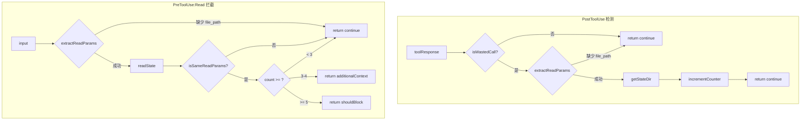

# Deep Dive: handlers.mjs — 双 Handler

## 概述

`src/handlers.mjs` 实现插件的**核心检测与拦截逻辑**，包含两个互补的 handler：

| Handler | 职责 | 触发时机 |
|---------|------|----------|
| `postToolUse()` | **检测** wasted call，更新计数器 | Read 工具执行**后** |
| `preToolUseRead()` | **拦截**即将执行的 Read，注入警告或阻断 | Read 执行**前** |

两个 handler 通过文件系统状态文件间接通信。

## 架构



## postToolUse() — 检测 wasted call

### 流程

```javascript
export function postToolUse(input) {
  // 1. 过滤非 Read 工具
  const toolName = input?.tool_name;
  if (toolName !== 'Read') return { continue: true, suppressOutput: true };

  // 2. 检测 wasted call 信号
  const toolResponse = input?.tool_response;
  if (!isWastedCall(toolResponse)) return { continue: true, suppressOutput: true };

  // 3. 提取 Read 参数
  const params = extractReadParams(input);
  if (!params) return { continue: true, suppressOutput: true };

  // 4. 获取状态目录并递增计数器
  const stateDir = getStateDir(input.cwd, input.session_id, input.agent_id, input.agent_type);
  incrementCounter(stateDir, { sessionId: input.session_id, ...params });

  return { continue: true, suppressOutput: true };
}
```

### 提前返回设计

`postToolUse()` 采用**守卫模式（Guard Clause）**，每个条件不满足时立即返回，避免嵌套。这是有意为之的设计：

- **非 Read 工具**：大多数工具调用都不是 Read，这是最快的短路路径
- **非 wasted call**：正常 Read 占多数，次快短路
- **缺少 file_path**：异常情况，静默跳过

### isWastedCall() — 多模式检测

```javascript
export function isWastedCall(toolResponse) {
  if (typeof toolResponse === 'string') {
    return toolResponse.includes('Wasted call');
  }
  if (toolResponse && typeof toolResponse === 'object') {
    if (typeof toolResponse.content === 'string' && 
        toolResponse.content.includes('Wasted call')) {
      return true;
    }
    // JSON.stringify 兜底
    return JSON.stringify(toolResponse).includes('Wasted call');
  }
  return false;
}
```

**为什么需要三层检测？**（D6 决策）

Claude Code 的 `toolResponse` 格式可能在不同版本中变化：
1. **字符串**：最常见，直接包含提示文本
2. **对象含 `content`**：某些版本可能包装为 `{ content: "..." }`
3. **`JSON.stringify` 兜底**：对象嵌套深层时，序列化后全文搜索

性能影响：`JSON.stringify` 仅在字符串和 `content` 字段都不匹配时执行，正常路径开销极小。

## preToolUseRead() — 拦截 Read

### 流程

```javascript
export function preToolUseRead(input) {
  const params = extractReadParams(input);
  if (!params) return { continue: true, suppressOutput: true };

  const stateDir = getStateDir(input.cwd, input.session_id, input.agent_id, input.agent_type);
  const state = readState(stateDir);

  // 状态不存在或参数不同 → 放行
  if (!state || !isSameReadParams(state, params.filePath, params.offset, params.limit)) {
    return { continue: true, suppressOutput: true };
  }

  const count = state.consecutiveWastedReads || 0;

  if (count >= BLOCK_THRESHOLD) {
    // 强制阻断
    const message = `[cc-break-dead-loop] 检测到 Read 死循环：已连续 ${count} 次读取文件「${params.filePath}」，每次返回「文件未改动」。请使用之前的读取结果，不要再重复 Read 同一文件。`;
    return { shouldBlock: true, systemMessage: message };
  }

  if (count >= WARN_THRESHOLD) {
    // 注入警告
    return {
      continue: true,
      suppressOutput: false,
      hookSpecificOutput: {
        hookEventName: 'PreToolUse',
        additionalContext: `⚠️ [cc-break-dead-loop] 警告：这是第 ${count} 次重复读取文件「${params.filePath}」，该文件未改动。请直接使用之前的读取结果，避免继续 Read 同一未改动文件。`,
        permissionDecision: 'allow',
      },
    };
  }

  return { continue: true, suppressOutput: true };
}
```

### 渐进式干预策略

| 计数 | 行为 | 目的 |
|------|------|------|
| 1-2 | 完全静默 | 避免干扰正常操作 |
| 3-4 | 注入 `additionalContext` | 提醒 agent 注意，但不阻断 |
| >= 5 | 强制阻断（exit 2） | 阻止死循环继续 |

**为什么 3 次警告、5 次阻断？**

- **3 次**：agent 可能确实需要重新确认文件内容（如文件刚被外部修改）
- **5 次**：超过合理重试次数，确认为死循环

### additionalContext 注入

`additionalContext` 是 Claude Code PreToolUse Hook 的特殊字段，用于向 agent 提供额外上下文而不阻断操作：

```javascript
hookSpecificOutput: {
  hookEventName: 'PreToolUse',
  additionalContext: '⚠️ 警告文案...',
  permissionDecision: 'allow',  // 明确允许执行
}
```

`permissionDecision: 'allow'` 告诉 Claude Code 这个 Read 请求被允许继续执行，但 agent 会看到警告信息。

### 阻断文案设计

阻断时的 `systemMessage` 包含三个关键信息：
1. **插件标识**：`[cc-break-dead-loop]` — 明确来源
2. **问题描述**：已连续 N 次读取同一文件，文件未改动
3. **行动指引**：请使用之前的读取结果，不要再重复 Read

文案使用中文，因为目标用户（插件使用者）主要使用中文环境。

## extractReadParams() — 参数提取

```javascript
function extractReadParams(input) {
  const toolInput = input?.tool_input;
  if (!toolInput || typeof toolInput !== 'object') return null;

  const filePath = toolInput.file_path;
  if (!filePath) return null;

  return {
    filePath,
    offset: toolInput.offset,
    limit: toolInput.limit,
  };
}
```

**注意**：`offset` 和 `limit` 可为 `undefined`，这是合法值。缺失这些字段时，Claude Code 的 Read 默认从文件开头读取全部内容。

## 测试覆盖

| 测试领域 | 断言数 | 关键场景 |
|----------|--------|----------|
| `isWastedCall` | 6 | 字符串/对象 content/嵌套对象/非对象 |
| `postToolUse` | 6 | 正常内容/非 Read/缺少 file_path/三种 wasted call 模式 |
| `preToolUseRead` | 6 | 放行/警告/阻断/参数变化放行/文案验证 |

**测试数据隔离**：使用 `baseInput` 固定参数模板，每个测试通过不同的 `session_id` 和 `agent_id` 隔离状态文件，避免交叉污染。
