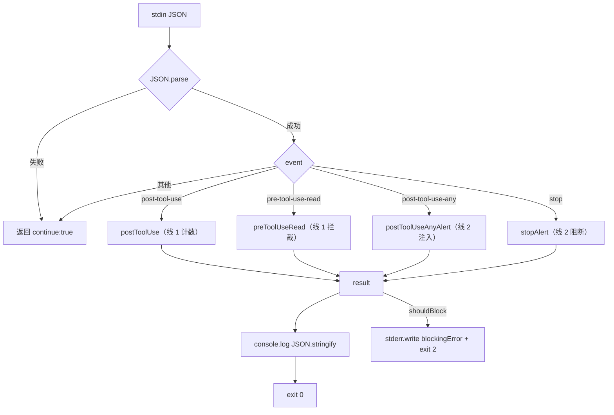

# Deep Dive: index.mjs — Hook 入口

## 概述

`plugin/src/index.mjs` 是整个插件的**单一入口点**，负责 stdin 解析、4 事件分发、Stop 阻断、统一错误边界。它被两处调用：

1. **模块入口**：`import { main } from '../src/index.mjs'`（由 `plugin/scripts/node-runner.mjs` 使用）
2. **CLI 入口**：`node plugin/src/index.mjs <event>`（开发调试用）

## 职责

- 解析 stdin 注入的 JSON（HookInput）
- 根据 event 名称分发到对应 handler（线 1）/ injector（线 2）
- **Stop 阻断**：`shouldBlock` 标记 → 由调用方 `node-runner` 翻译为 `exit(2)` + stderr
- **统一错误边界**：任何内部错误都返回 `{ continue: true }` 静默失败

## 架构



## 关键代码分析

### main() 函数 — 4 事件分发

```javascript
export async function main(event, stdinData) {
  let input;
  try {
    input = JSON.parse(stdinData || '{}');
  } catch {
    return { continue: true, suppressOutput: true };
  }

  switch (event) {
    case 'post-tool-use':
      return postToolUse(input);          // 线 1：主 agent Read 计数
    case 'pre-tool-use-read':
      return preToolUseRead(input);        // 线 1：主 agent Read 拦截
    case 'post-tool-use-any':
      return postToolUseAnyAlert(input);   // 线 2：子 agent 告警注入
    case 'stop':
      return stopAlert(input);             // 线 2：Stop 阻断
    default:
      return { continue: true, suppressOutput: true };
  }
}
```

**设计要点**：
- `JSON.parse` 失败时静默返回 `continue: true`（错误边界）
- `stdinData || '{}'` 处理空输入
- 同步 `switch` 分发，事件类型固定
- 线 1 事件委托 `handlers.mjs`，线 2 事件委托 `hookInjector.mjs`（经内部 `postToolUseAnyAlert` / `stopAlert` 包装）

### postToolUseAnyAlert — 线 2 PostToolUse 注入

```javascript
function postToolUseAnyAlert(input) {
  const sessionId = input?.session_id;
  if (!sessionId) return { continue: true, suppressOutput: true };

  const injection = buildInjection({
    filePath: ALERTS_FILE,
    sessionId,
    event: 'PostToolUse',
  });

  if (!injection) return { continue: true, suppressOutput: true };

  return {
    continue: true,
    suppressOutput: false,
    hookSpecificOutput: {
      hookEventName: 'PostToolUse',
      additionalContext: injection.additionalContext,
    },
  };
}
```

PostToolUse:`*` Hook（任意工具执行后）触发。读 `alerts.json`，若有当前 session 的子 agent 死循环告警，注入 `additionalContext` 引导主 agent 调 `TaskStopTool`。

### stopAlert — 线 2 Stop 阻断

```javascript
function stopAlert(input) {
  const sessionId = input?.session_id;
  if (!sessionId) return { continue: true, suppressOutput: true };

  const injection = buildInjection({
    filePath: ALERTS_FILE,
    sessionId,
    event: 'Stop',
  });

  if (!injection) return { continue: true, suppressOutput: true };

  return {
    shouldBlock: true,
    systemMessage: injection.blockingError,
  };
}
```

Stop Hook（主 agent 结束 turn）触发。若有未处理告警，返回 `{ shouldBlock, systemMessage }`。**注意**：这里不返回标准 hook JSON，而是 `shouldBlock` 标记，由调用方 `node-runner` 翻译为 `exit(2)` + stderr，触发 Claude Code 的 blockingError 机制，强制主 agent 继续 turn。

### CLI 入口

```javascript
if (import.meta.url === `file://${process.argv[1]}`) {
  // ...stdin 收集...
  process.stdin.on('end', async () => {
    try {
      const result = await main(event, data);

      // Stop hook 的 blockingError：exit 2 + stderr
      if (result?.shouldBlock) {
        process.stderr.write(result.systemMessage);
        process.exit(2);
      }

      console.log(JSON.stringify(result));
      process.exit(0);
    } catch {
      console.log(JSON.stringify({ continue: true, suppressOutput: true }));
      process.exit(0);
    }
  });
}
```

CLI 直接运行时，`shouldBlock` → `stderr.write` + `exit(2)`。

## 输入/输出契约

### 输入（stdin JSON）

| 字段 | 类型 | 必填 | 说明 |
|------|------|------|------|
| `tool_name` | string | 线 1 | PostToolUse/PreToolUse 时，如 "Read" |
| `tool_input` | object | 线 1 | 含 `file_path`、`offset`、`limit` |
| `tool_response` | any | PostToolUse:Read | Read 返回结果 |
| `session_id` | string | 是 | 会话 ID（线 2 据此过滤告警）|
| `agent_id` | string | 否 | 线 1 计数隔离用，空值 fallback "main" |
| `cwd` | string | 线 1 | 项目名解析 |

### 输出（stdout JSON / stderr + exit code）

| 场景 | 输出 |
|------|------|
| 线 1 放行 | `{ "continue": true, "suppressOutput": true }` |
| 线 1 警告 | `{ "continue": true, "suppressOutput": false, "hookSpecificOutput": { "hookEventName": "PreToolUse", "additionalContext", "permissionDecision": "allow" } }` |
| 线 1 阻断 | `{ "continue": false, "hookSpecificOutput": { "hookEventName": "PreToolUse", "permissionDecision": "deny", "permissionDecisionReason", "additionalContext" } }` |
| 线 2 PostToolUse 注入 | `{ "continue": true, "suppressOutput": false, "hookSpecificOutput": { "hookEventName": "PostToolUse", "additionalContext" } }` |
| 线 2 Stop 阻断 | `stderr: blockingError` + `exit(2)`（触发 Claude Code blockingError 机制）|
| 错误降级 | `{ "continue": true, "suppressOutput": true }` + exit(0) |

## 错误边界设计

本文件是**第二层错误边界**（第一层是 `node-runner.mjs`）。`main()` 内部无 try/catch（handler 是纯函数不抛异常），错误边界集中在 CLI 入口：

```
stdin.on('end') 中的 try/catch
    ├── main() 调用
    │   ├── JSON.parse 失败 → 已内部处理
    │   ├── 线 1 handler → 纯函数
    │   └── 线 2 buildInjection → 读 alerts.json（alertStore 内部 try/catch）
    └── 任何异常 → { continue: true } + exit(0)
```

## 测试覆盖

| 测试场景 | 覆盖文件 | 断言 |
|----------|----------|------|
| 4 事件分发 | integration.test.mjs | stdout 返回预期 JSON |
| 无效 event | integration.test.mjs | 返回 `{ continue: true }` |
| stdin 空/非法 | integration.test.mjs | 不崩溃，返回 `{ continue: true }` |
| Stop 阻断 exit 2 | integration.test.mjs | `code === 2`，stderr 含 blockingError |
| 直接运行 CLI | integration.test.mjs | 正确处理 stdin |
