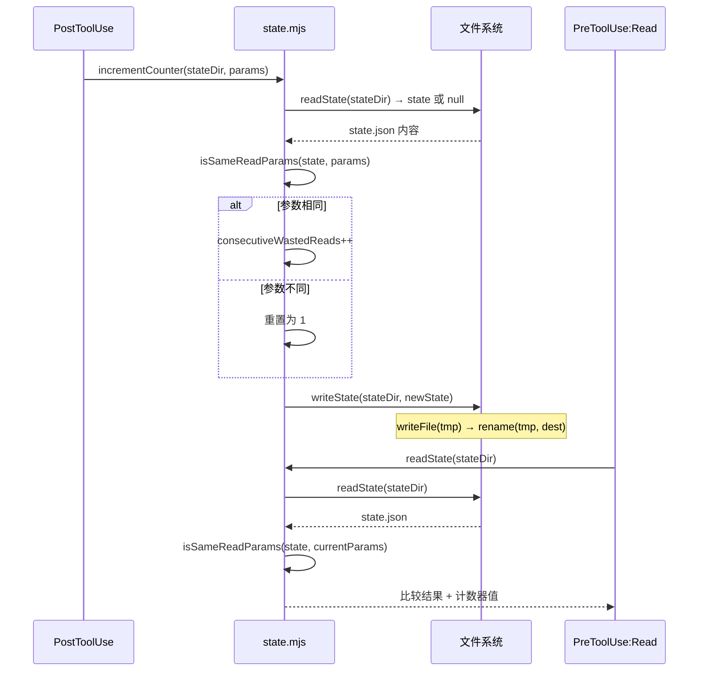

# Deep Dive: state.mjs — 状态管理

## 概述

`src/state.mjs` 负责插件的核心状态持久化：读写状态文件、原子写入、计数器逻辑、参数比较。它是 PostToolUse 和 PreToolUse:Read 两个 handler 之间的**唯一通信渠道**。

## 状态文件生命周期



## 状态目录结构

```javascript
export function getStateDir(cwd, sessionId, agentId, _agentType) {
  const project = getProjectName(cwd);
  const session = sanitizeName(sessionId || 'unknown');
  const agent = sanitizeName(agentId || 'main');
  return join(DATA_DIR, project, session, agent);
}
```

### 隔离维度

| 维度 | 来源 | 安全化处理 |
|------|------|-----------|
| project | `git remote get-url origin` 或 `cwd` 文件夹名 | `sanitizeName` |
| session | `session_id` | `sanitizeName` |
| agent | `agent_id`（空值用 "main"） | `sanitizeName` |

**为什么需要三层隔离？**

- **project**：同一用户可能同时打开多个项目，避免跨项目干扰
- **session**：Claude Code 会话间状态不累积（D4 决策：不跨会话）
- **agent**：子代理和主代理的 Read 行为独立，主代理的读取不应被子代理的死循环影响

### 安全化规则

```javascript
export function sanitizeName(name) {
  if (!name || typeof name !== 'string') return 'unknown';
  let safe = name.replace(/[^a-zA-Z0-9-]/g, '-');  // 只保留字母数字连字符
  safe = safe.replace(/^-+|-+$/g, '');              // 去除首尾连字符
  safe = safe.slice(0, 64);                          // 限制 64 字符
  return safe || 'unknown';                          // 空结果 fallback
}
```

示例：
| 输入 | 输出 | 说明 |
|------|------|------|
| `my-project_123` | `my-project-123` | 下划线转连字符 |
| `-hello-` | `hello` | 去除首尾连字符 |
| `___` | `unknown` | 空结果 fallback |
| `x`.repeat(100) | `x`.repeat(64) | 截断到 64 字符 |

## 原子写入

```javascript
export function writeState(stateDir, state) {
  const filePath = join(stateDir, STATE_FILE);
  const tmpPath = `${filePath}.tmp.${Date.now()}`;
  mkdirSync(stateDir, { recursive: true });
  writeFileSync(tmpPath, JSON.stringify(state, null, 2));
  renameSync(tmpPath, filePath);
}
```

**为什么使用 `rename` 而非直接写入？**

`rename` 在大多数文件系统上是**原子操作**：要么新文件完全可用，要么旧文件保持不变。这避免了并发场景下的文件损坏。

**并发测试验证**：`tests/state.test.mjs` 中并发调用 20 次 `incrementCounter`，验证文件始终是合法 JSON。

## 计数器逻辑

```javascript
export function incrementCounter(stateDir, params) {
  const { sessionId, filePath, offset, limit } = params;
  const state = readState(stateDir);

  if (isSameReadParams(state, filePath, offset, limit)) {
    const newState = {
      ...state,
      consecutiveWastedReads: (state.consecutiveWastedReads || 0) + 1,
      lastUpdatedAt: new Date().toISOString(),
    };
    writeState(stateDir, newState);
    return newState.consecutiveWastedReads;
  }

  // 参数变化，重置计数
  const newState = {
    sessionId,
    filePath,
    offset,
    limit,
    consecutiveWastedReads: 1,
    lastUpdatedAt: new Date().toISOString(),
  };
  writeState(stateDir, newState);
  return 1;
}
```

### 重置条件

计数器在以下任一情况变化时**重置为 1**：
- `filePath` 改变（读取不同文件）
- `offset` 改变（读取不同起始位置）
- `limit` 改变（读取不同行数）

### 参数比较（D7 决策）

```javascript
export function isSameReadParams(state, filePath, offset, limit) {
  if (!state) return false;
  return (
    state.filePath === filePath &&
    state.offset === offset &&
    state.limit === limit
  );
}
```

**关键设计：使用 `===` 直接比较，不规范化 `undefined→0`**

| 场景 | `offset` A | `offset` B | `===` 结果 | 行为 |
|------|-----------|-----------|-----------|------|
| 默认读取 | `undefined` | `undefined` | `true` | 继续计数 |
| 显式从 0 开始 | `0` | `0` | `true` | 继续计数 |
| 混合 | `undefined` | `0` | `false` | **重置计数** |

**为什么这样设计？** 参数规范应交给 Claude Code 和 LLM。若 CC 传入 `offset: undefined`（未指定）和 `offset: 0`（显式从开头），它们代表不同的调用意图，不应等同。

## 状态文件格式

```typescript
interface DetectionState {
  sessionId: string;            // Claude Code 会话 ID
  filePath: string;             // 被读取的文件路径
  offset?: number;              // 读取起始行（可选）
  limit?: number;               // 读取行数（可选）
  consecutiveWastedReads: number;  // 连续无效 Read 次数
  lastUpdatedAt: string;        // ISO 8601 时间戳
}
```

示例：
```json
{
  "sessionId": "sess-abc-123",
  "filePath": "/Users/lionad/project/src/main.ts",
  "offset": 10,
  "limit": 50,
  "consecutiveWastedReads": 4,
  "lastUpdatedAt": "2026-05-10T05:30:00.000Z"
}
```

## 错误处理

| 函数 | 错误场景 | 行为 |
|------|----------|------|
| `readState` | 文件不存在 | 返回 `null` |
| `readState` | JSON 解析失败 | 返回 `null` |
| `writeState` | 目录不存在 | `mkdirSync` 自动创建 |
| `writeState` | 磁盘满 | 抛出异常（由上层错误边界捕获） |

## 测试覆盖

`tests/state.test.mjs` 包含 20 项断言：

| 测试组 | 断言 | 场景 |
|--------|------|------|
| `sanitizeName` | 4 | 保留字符/去除首尾连字符/空结果 fallback/截断 |
| `getProjectName` | 3 | git 仓库/无 git 目录/空路径 |
| `getStateDir` | 2 | 正确路径/agent_id 为空时用 main |
| `writeState` | 1 | 自动创建目录 |
| `readState` | 2 | 正确读取/文件不存在返回 null |
| `incrementCounter` | 4 | 连续递增/参数变化重置/undefined vs 0/并发安全 |
| `isSameReadParams` | 4 | 相同/不同/undefined vs 0/null |

**并发测试**：
```javascript
const promises = Array.from({ length: 20 }, () =>
  new Promise((resolve) => {
    setTimeout(() => {
      resolve(incrementCounter(dir, params));
    }, Math.random() * 10);
  })
);
```

验证原子写入下文件始终是合法 JSON，即使部分递增丢失。
